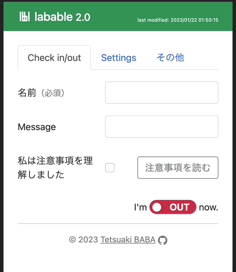

# labable


研究室入退室をSlackを利用して簡単に管理するためのツール。slackのwebhook URLを利用して、phpとjsで任意のslackチャンネルに入退室を通知します。コロナ後を見据えて体温入力などの面倒な部分は、注意事項に同意することでまとめました。適当なphpが動くサーバにデプロイして、そのページをホーム画面に追加すると便利です。

# version
 * 2.1:
   * 入室回数を記録、表示する機能を追加
 * 2.0: 
   * 体温入力を省略
   * 入室ユーザ一覧の氏名をクリックすると詳細が確認できるように
   * 入室ユーザ氏名の横に入室時刻を示す時計アイコンを追加
   * メッセージがユーザ一覧にも表示される
   * 日付を跨いで入りっぱなしのユーザは自動で退出処理
   * ヘッダ部分にlast modifiedの最終更新日を追加
   * コピーライトを2023に

 * 1.0: https://github.com/TetsuakiBaba/labable/tree/1.0


## はじめる

1. https://tetsuakibaba.jp/project/labable/getStart.html にアクセス
2. 登録したいslackの webhook URLとチャンネルを入力して create ボタンを押す
3. 生成されたリンクにアクセスして利用開始です。

ローカル環境でテスト動作させる場合は以下の手順。
 ```
git clone https://github.com/TetsuakiBaba/labable.git
cd labable
echo '<?php $sslkey = 'set your ssl key here'; ?>' > sslkey.php
php -S locahost:8000
```

ブラウザから localhost:8000 で閲覧してください。送信したいチャンネル合わせてindex.htmlのチャンネル欄の値を変更してください。phpコマンドがない場合はmacはbrew等でインストールしてあげてください。

webhook URLの取得については https://slack.com/intl/ja-jp/help/articles/115005265063-Slack-%E3%81%A7%E3%81%AE-Incoming-Webhook-%E3%81%AE%E5%88%A9%E7%94%A8 を参照してください。

## Dependency
  * SVG.js: https://github.com/svgdotjs/svg.js
  * svgclock.js: https://github.com/TetsuakiBaba/svgclock.js

  
## Reference
  * phpでSlackにメッセージを送る：https://qiita.com/kdtsh/items/814e766080a9761b14a7